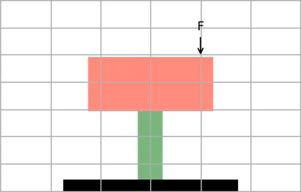
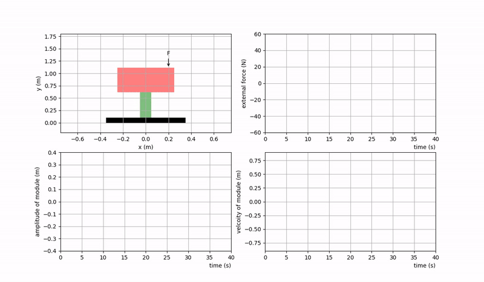

# Harmonic Excitation
## Harmonic Excitation with Linear and Nonlinear Models

### Problem Statement
Harmonic excitation is very common in vibrating systems. More complex excitation can be considered as summation of multiple harmonic excitations.

An electronics module is mounted on a machine and is modeled as an SDOF spring-mass-damper system. The module is subject to a harmonic forces F01 = 50 N at w1 = 3 rad/s and F02 = 25 N at w2 = 6 rad/s. Assume the following parameters: m =75 kg, K = 250 N/m, c = 8 kg/s. Assume the initial conditions of the system are x0/sub> = 0.01 m and v0 = 0.5 m/s. The module's amplitude of vibration must be less than 0.4 m,  and its speed must be under 0.8 m/s, both even during the transient stage.

This lab has parts A, B, and C.

### Part A
**[A][45%]** Simulate the response of the system. Solve the equations of the motion numerically using ODE library.

**[A-1]** Plot the response of the system for 40 seconds.  
	**(I)** Show a plot, amplitude vs time [5%] and velocity vs time [5%], both on one plot side by side.
	**(II)** With the parameters given, is the design constraint achievable? [5%]

Hint: open the file `mass_spring_damper.py` and complete **TODO1**. Then run the code for part a.

**[A-2]** You are allowed to increase the damping coefficient, by the steps of 4 kg/s, starting from 30 kg/s, and ending at 98 kg/s. What is the smallest value of c such that the maximum vibration amplitude is limited to 0.26 m and the maximum speed is limited to 0.60 m/s? Use an exhaustive search method to search for the values of the damping coefficient. In your report, present: 
- **(I)** a graph demonstrating max velocity/max amplitude vs damping coefficient [5%]. Reports these graphs for the right value of c, for 40 seconds.
* **(II)** Report the value of c satisfying the constraints. [5%].
+ **(III)** For the value satisfying the constraints, preset amplitude vs time [5%] and velocity vs time [5%], both on one plot side by side. 

Hint: In file `excitation_a.py`, complete **TODO2-3**.

**[A-3]**  In your lab report, present the code you developed for only TODO1-3 [10%]. Attached the full code.

### Part B
**[B][35%]** You realize that the spring model you used in Part a is not accurate. A correct model is F(x) = kx – k1sgn(x)x3sup>, where k = 250 N/m remains the same and k1 = 400 N/m3. You will repeat Part a with this model. Solve the equations of the motion numerically using ODE library, based on the new model. Assume c = 10 kg/s.

**[B-1]** Plot the response of the system for 40 seconds. Your plot must include the results of both linear and nonlinear models. Use a solid line for the nonlinear model. Use a dashed line for the linear model. Report
- **(I)** amplitude vs time for both models on the same plot  [5%] and amplitude error vs time [5%], on the same plot, side by side. 
* **(II)** velocity vs time for both models on the same plot  [5%] and velocity error vs time [5%], on the same plot, side by side.
+ **(III)** what are the differences between the models in terms of frequency and amplitude? [5%]
- **(III)** (iv)	with the parameters given, are the original design constraints achievable (amplitude of vibration must be less than 0.4 m, and its speed must be under 0.8 m/s) You must regenerate the graph of [A-2-I] with this new model? [5%]

Hint: open the file `mass_spring_damper.py` and complete **TODO4**.

**[B-2]** In your lab report, report the code you developed for only **TODO4** [5%]. Attached the full code.  

### Part C
**[C][20%]** With the nonlinear spring model, you want to simulate a nonlinear damping system with the mode of F(x) = α (dx/dt)2 sgn(dx/dt), where α = 8 in SI units. This model is known as air damping. You will repeat Part B with this model. Solve the equations of the motion numerically using ODE library.

**[C-1]** Plot the response of the system for 40 seconds. Your plot must include the results of both linear damper (c=10 kg/s) and nonlinear models. Use a solid line for the nonlinear model. Use a dashed line for the linear model. Report  
- **(I)** amplitude vs time for both models on the same plot [10%]
* **(II)** what are the differences between the models in terms of frequency and amplitude? [5%]

Hint: open the file `excitation_C.py` and complete **TODO5**.
 
**[C-2]** In your lab report, report the code you developed for only TODO5 [5%]. Attached the full code.

### Animations
Animation of mass-spring-damper system under harmonic excitation:\

