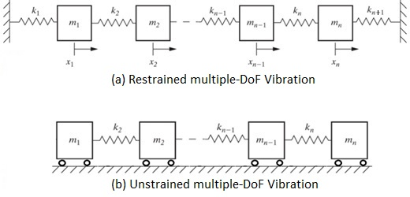

# Simulation of a multiple-DOF vibration system
## Connected Masses

### Problem Statement
Several masses and springs are set up as shown in the following figure. Using modal analysis, the objective is to determine the free response of the system.

The system can be modeled as a multiple degree of freedom, with the following parameters:
m1 = 2 [kg], m2 = 2 [kg], m3 = 2 [kg] 

k1 = 2 [N/m], k2 = 2 [N/m], k3 = 2 [N/m], k4 = 2 [N/m]

This lab has two parts A and B.

Important: Attach the complete code with completed TODOs as a zip file. No code means a zero grade.

### Part A - Modal Analysis 
**[A][50%]** Simulate the response of the system. Assume the initial conditions are:
X0 = (0, 0, 0) m and V0 = (0, 0.5, 0) m/s

Plot the displacement response of the system for 40 seconds. Provide the following items:

**[A-1]** Report the amplitude vs time graph in the modal space [5%]. 

**[A-2]** Report the amplitude vs time graph in the physical space [5%].

**[A-3]** Report all eigenvalues [5%].

**[A-4]** Report the natural frequencies [5%] Hint: complete **TODO1-12**.

**[A-5]** Change the parameters such that you can simulate the unrestrained behavior of the system, shown above. What did you need to change? [5%]

**[A-6]** How did the natural frequencies change? [5%] Complete **TODO13**.  

**[A-7]** Report the amplitude vs time graph in the modal space, for the unrestrained vibration [5%]. 

**[A-8]** Report the amplitude vs time graph in the physical space, for the unrestrained vibration [5%].

**[A-9]** Report **TODO11** [5%] and **TODO13** [5%]. Do not report the other TODOs.

### Part B – ODE Library 
**[B][50%]** 
For the restrained system, simulate the response of the system, solve the equations of the motion numerically using the ODE library. Assume the initial conditions are:
X0 = (0, 0, 0) m and V0 = (0, 0.5, 0) m/s

Plot the displacement response of the system for 40 seconds. You should report two graphs. 

**[B-1]** Report the amplitude vs time graph in the physical space [10%]. 

**[B-2]** Report the velocity vs time graph in the physical space [10%].

**[B-3]** What are (is) the differences between physical displacement plots for part A-2 and part B-1? [5%].

With the given initial conditions, assume an impulse, with the magnitude of F = 2 N.s,  is applied to mass m2 at time t=0. The direction of the impulse is parallel to the surface and is pointing to m1. Simulate the response of the system using the ODE method.

**[B-4]** What did you do to simulate the impulse? Explain [3%]. Report the code you added [2%].

**[B-5]** Report the amplitude vs time graph in the physical space [10%].

**[B-6]** Report the velocity vs time graph in the physical space [10%]. 

Hint: complete **TODO14-16** and **complete **TODO18-20**. 

### Animations
Animation of the system, both ends are fixed:\

Animation of the system, both ends are free:\

