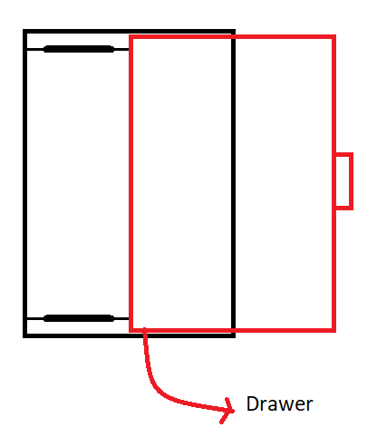
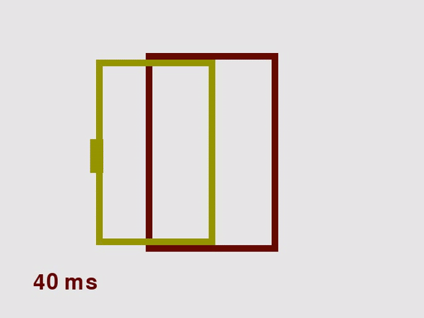

# Simulation of a single-DOF vibration system
## Sliding Drawer

### Problem Statement
Soft-close drawer slides are used to make sure the drawer is closed softly. One of the advantages of such systems is that no electricity is required to close the drawer. 

The system can be modeled as a single degree of freedom, with a point mass of m [kg] (for the drawer), spring stiffness of k [N/m], and the damping coefficient of c [F/m/s]. Refer to the course material for the EOM of the system. Assume m = 1, k = 3, c = 2.

This lab has parts A, B, C, D, and E.

### Part A
**[A][20%]** Simulate the response of the system, assuming the drawer is opened by 50 cm and released from rest. Use a closed-form solution to simulate the response of the system. Refer to your textbook, for the formulations. To use the right formulation, you need to know if the system is underdamped, overdamped, etc. Follow the steps below.

**[A-1]** Determine the roots of the system [2%]. What do the roots state about the system? [1%]
Hint: open the file `drawerlab/mass_spring_damper.py` and complete **TODO1**.
By running `drawer_a.py`, you will see the results.
	
**[A-2]** Once you know the type of the system, in file `drawer_a.py`, complete **TODO2-5**.

Reports three graphs, showing the time response of the system, i.e. 
- **(I)** position vs time [4%], 
* **(II)** velocity vs time [4%], and 
+ **(III)** acceleration vs time [4%]. 
These graphs are saved on your computer.

**[A-3]** In your lab report, report the code you developed for only **TODO1-5** [5%]. Attached full code.

### Part B
**[B][15%]** Solve the equations of the motion numerically using ODE library.

Note: You can disable/enable simulation from here: `drawerlab/settings.py`. 

**[B-1]** You will need to run `drawer_b.py`. But first, open file `drawerlab/mass_spring_damper.py` and complete task **TODO6-7**. Refer to your textbook or online resource for solving differential equations using ODE. Report two graphs, showing the time response of the system, i.e. 
- **(I)** position vs time [5%], 
* **(II)** velocity vs time [5%].  

**[B-2]** In your lab report, report the code you developed for only TODO6-7 [5%]. Attached full code.

### Part C
**[C][10%]** Calculate the amount of kinetic energy, if the drawer comes in contact with the cabinet frame when closing. 

You will need to run `drawer_c.py`. But first, open file `drawerlab/mass_spring_damper.py` again and complete task **TODO8**

**[C-1]** Report the formulation of calculations [2%]

**[C-2]** Report the amount of kinetic energy in Joules which is calculated once you run the code [4%]

**[C-3]** How long did it take for the drawer to close, assume the drawer closes once it hits the frame [2%]

**[C-4]** In your lab report, report the code you developed for only **TODO8** [2%]. Attached full code.

### Part D
**[D][20%]** You are allowed to choose the damping coefficient from 0.1, 0.2, …, 3.0, 3.1. such that the kinetic energy upon impact is at most 0.01 [J]. 

You will need to run `drawer_d.py`. 

**[D-1]** Report a plot demonstrating the kinetic energy on the y-axis vs the permitted damping coefficient on the x-axis, i.e. 0.1, 0.2, …, 3.0, 3.1. [8%]

**[D-2]** Pick the first values for c from the range such that the kinetic energy is less than 0.01 [J] and plot position-time [4%], and velocity-time [4%]. You can choose the right values for c from the graph. Then complete task **TODO9**.

**[D-3]** With the value selected, how long did it take for the drawer to close, assume the drawer closes once it hits the frame [2%].

**[D-4]** In your lab report, report the code you developed for only **TODO9** [2%]. Attached full code.

### Part E
**[E][35%]** You are allowed to change both spring constant in range {0.1, 0.2, …, 2.3, 2.4} and the damping coefficient in range {0.1, 0.2, …, 2.3, 2.4}.

Open `drawer_e.py`, complete task **TODO10**, and run the code.

**[E-1]** Report a plot demonstrating all k values on the y-axis vs all c values on the x-axis. The plot should show the permissible range for c and k, such that the drawer is closed in 10 seconds. [10%]

**[E-2]** Pick a value for c and k from the permissible range, such that the KE is minimized [5%]. Report the closing time [5%].

**[E-3]** Pick a value for c and k from the permissible range, such that the KE is maximized [5%]. Report the closing time [5%].

**[E-4]** In your lab report, report the code you developed for only **TODO10** [5%]. Attach the full code.

### Animations
An example of an overdamped design:\

An example of an underdamped design:\

An example of an underdamped design:\

If you want to record the videos, you need to enable it in `drawerlab/settings/py`, i.e. `self.make_video = True`. You also need to make sure `ffmpeg` is installed on your system.

